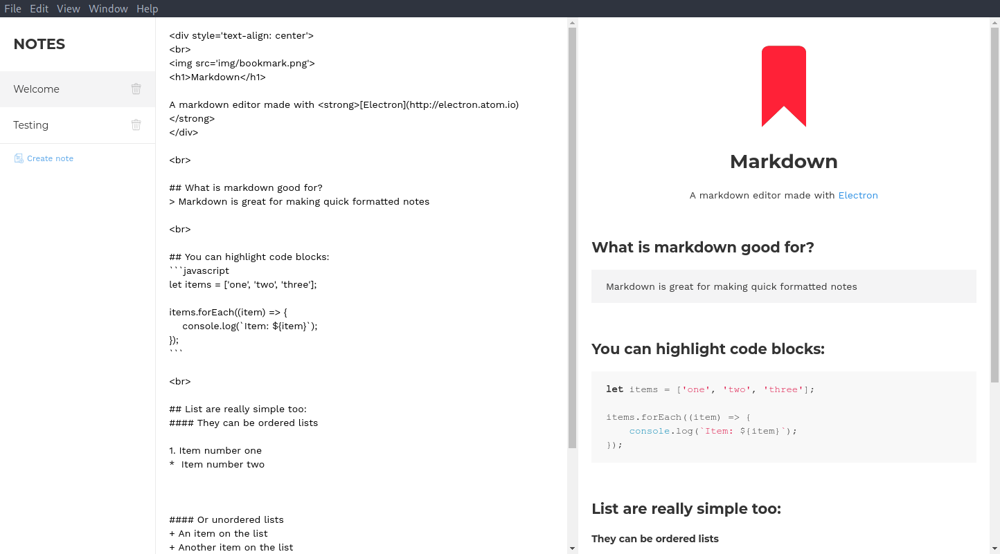

# Marquee

> Zero fuss markdown note taking

Cross platform markdown note taking application written in electron




## Installation

```sh
git clone ... && cd ...
npm install
electron .
```


## Build instructions

Build app to dist/ directory
```sh
npm run dist
```


## Built with

[Electron](https://electronjs.org) - Cross platform desktop apps with JS, HTML & CSS
